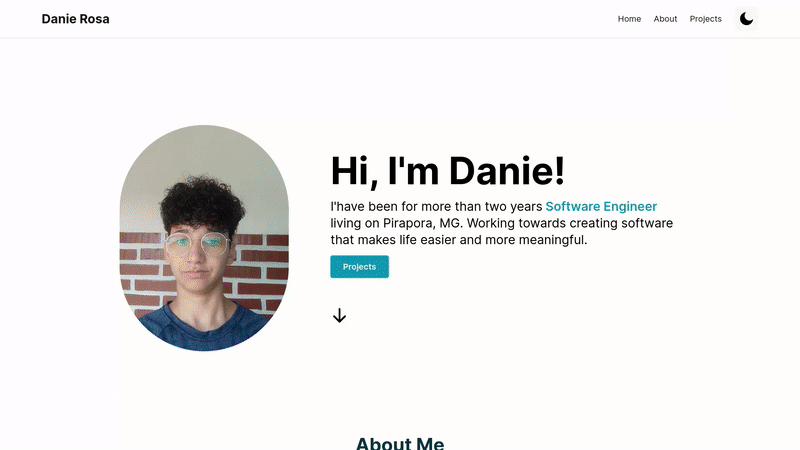

<p align="center">
  
</p>

<p>Link para visitar o site : 
<a href="https://portifolio-dany679.vercel.app/"/>Demo</a>
</p>
<p align='center'> Portifolio 2.0 <p/>

<p align="center">
  <a href="#-projeto">Projeto</a>&nbsp;&nbsp;&nbsp;|&nbsp;&nbsp;&nbsp;
   <a href="#-Tecnologias">Tecnologias</a>

<p align="center">
 

  
</p>

<br>

## 🚀 Tecnologias

Esse projeto foi desenvolvido com as seguintes tecnologias:

- Next.14
- Type Script
- Hooks
- Tailwind
- Storybook

## 💻 Projeto

O projeto sera um site de portfólio desenvolvido no next.14 no qual o deploy foi executado no vercel, para verificar olhe o demo acima <a href="https://vercel.com/" /> vercel</a>

## :memo: Licença

MIT

# :wrench: How To Run

To run this app on your computer, run these commands inside the repository root folder,
case you use npm just change to npm install and npm start

```shell
#  install dependencies, run :
$ npm i

# start
$ npm run build
$ npm run start

# dev
$ npm run dev

```

---
